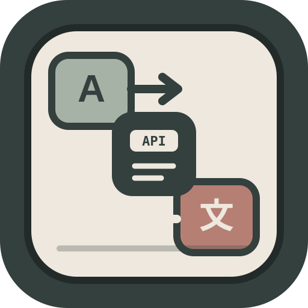

<div align="center">




# translators-api

**A small, self-hosted HTTP gateway that turns Python [Translators](https://github.com/UlionTse/translators) into a conventional JSON API.**

<p>
  
  
  
  
</p>

<p>
  <a href="#readme-overview">Overview</a> ·
  <a href="#readme-quick-start">Quick Start</a> ·
  <a href="#readme-api">API</a> ·
  <a href="#readme-configuration">Configuration</a> ·
  <a href="#readme-deployment">Deployment</a> ·
  <a href="#readme-development">Development</a>
</p>

</div>

---

<a name="readme-overview"></a>
##  Overview

`translators-api` adds a stable HTTP boundary around the Python **Translators** library.

The gateway accepts JSON, validates the request, applies optional authentication and process-local rate limiting, selects an upstream translator, performs the translation without blocking the FastAPI event loop, and returns a predictable response with a request ID.

It is intentionally a gateway rather than a new translation engine: provider implementations, provider-specific behavior, language discovery, and upstream network interaction remain the responsibility of [UlionTse/translators](https://github.com/UlionTse/translators).

### What it gives clients

| Client side | Gateway responsibility | Upstream |
| :--- | :--- | :--- |
| HTTP + JSON | validation and error normalization | provider-specific translation |
| one request contract | translator selection | language/provider behavior |
| optional bearer token | rate limiting | upstream network access |
| request ID | fallback orchestration | service availability |

### Included capabilities

- Single-text translation
- Batch translation with bounded concurrency
- HTML-fragment translation
- Translator and language discovery
- Automatic fallback across configured translators
- Optional bearer authentication
- Request IDs in headers and response bodies
- Health and readiness endpoints
- Docker, Python package, and Windows x64 delivery paths

The project deliberately does **not** provide a database, account system, distributed queue, shared cache, or cluster-wide rate limiter.

---

<a name="readme-quick-start"></a>
##  Quick Start

### Requirements

- Python `3.10+`
- Network access to the selected upstream translator
- Docker for container deployment
- Windows x64 for the portable executable bundle

### Install from source

```bash
git clone https://github.com/CYoJkoY/translators-api.git
cd translators-api

python -m venv .venv
```

Activate the environment:

```bash
# Linux / macOS
source .venv/bin/activate

# Windows PowerShell
.\.venv\Scripts\Activate.ps1
```

Install the service:

```bash
python -m pip install --upgrade pip
python -m pip install .
```

For development and tests:

```bash
python -m pip install -e ".[test]"
```

### Start the server

```bash
uvicorn translators_api.main:app --host 127.0.0.1 --port 8000
```

Or use the packaged CLI:

```bash
translators-api --host 127.0.0.1 --port 8000
```

The CLI also supports `--log-level` and `--version`.

### Check health

```bash
curl http://127.0.0.1:8000/health
```

```json
{
  "status": "ok",
  "version": "0.1.0"
}
```

Then open:

| Path | Purpose |
| :--- | :--- |
| `/docs` | Swagger UI |
| `/redoc` | ReDoc |
| `/openapi.json` | OpenAPI document |
| `/health` | Process liveness |
| `/ready` | Upstream translator readiness |

### First translation

```bash
curl -X POST http://127.0.0.1:8000/v1/translate \
  -H "Content-Type: application/json" \
  -d '{
    "text": "你好，世界",
    "source": "zh",
    "target": "en",
    "translator": "bing"
  }'
```

A successful response follows this shape:

```json
{
  "text": "你好，世界",
  "translation": "Hello, world",
  "source": "zh",
  "target": "en",
  "translator": "bing",
  "fallback": false,
  "request_id": "req_..."
}
```

---

<a name="readme-api"></a>
##  API

Application endpoints live under `/v1`. Health and readiness endpoints stay outside that namespace so they remain easy to use from process and container checks.

### Endpoint map

| Method | Endpoint | Purpose |
| :--- | :--- | :--- |
| `GET` | `/health` | Confirm that the process is alive |
| `GET` | `/ready` | Check whether upstream translators are available |
| `GET` | `/v1/translators` | Discover available translator backends |
| `GET` | `/v1/languages` | Discover languages for a translator |
| `POST` | `/v1/translate` | Translate one text value |
| `POST` | `/v1/translate/batch` | Translate multiple text values |
| `POST` | `/v1/translate/html` | Translate an HTML fragment |

### `POST /v1/translate`

```json
{
  "text": "Hello, world!",
  "source": "en",
  "target": "zh-CN",
  "translator": "bing"
}
```

| Field | Type | Default | Notes |
| :--- | :--- | :--- | :--- |
| `text` | string | required | Non-blank text, limited by `MAX_TEXT_LENGTH` |
| `source` | string | `auto` | Source language identifier |
| `target` | string | `en` | Target language identifier |
| `translator` | string or `null` | configured default | Concrete backend or automatic fallback mode |

### `POST /v1/translate/batch`

```json
{
  "texts": ["Hello", "How are you?", "Good morning"],
  "source": "en",
  "target": "zh-CN",
  "translator": "auto"
}
```

Batch translation uses a semaphore to cap upstream concurrency at `MAX_BATCH_CONCURRENCY`. Returned items preserve input order with an explicit `index`.

```json
{
  "items": [
    { "index": 0, "text": "Hello", "translation": "你好" },
    { "index": 1, "text": "How are you?", "translation": "你好吗？" },
    { "index": 2, "text": "Good morning", "translation": "早上好" }
  ],
  "source": "en",
  "target": "zh-CN",
  "translator": "bing",
  "fallback": false,
  "request_id": "req_..."
}
```

When individual items use different fallback backends, `translator` can be `mixed`.

### `POST /v1/translate/html`

```json
{
  "html": "<p>Hello, <strong>world!</strong></p>",
  "source": "en",
  "target": "zh-CN",
  "translator": "bing"
}
```

HTML requests follow the same translator selection and fallback rules as text requests. The input is limited by `MAX_TEXT_LENGTH`.

### Translator discovery

```bash
curl http://127.0.0.1:8000/v1/translators
```

Example shape:

```json
{
  "translators": ["alibaba", "baidu", "bing"],
  "default": "bing",
  "fallback": ["bing", "google", "deepl", "baidu"]
}
```

The actual list is provided by the installed upstream package and may change independently of this repository.

### Language discovery

```bash
curl "http://127.0.0.1:8000/v1/languages?translator=bing"
```

Language identifiers come from the selected upstream backend.

### Automatic fallback

Use `auto`, `detect`, or `all` to route through the configured fallback sequence:

```text
request
  │
  ├─ concrete translator ──► that backend only
  │
  └─ auto / detect / all
          │
          ▼
  FALLBACK_TRANSLATORS
          │
          ├─ success ──► response
          ├─ failure ──► next backend
          └─ all fail ─► 502
```

The response sets `fallback: true` when an automatic request succeeds only after moving beyond the first candidate.

### Authentication

Set `TRANSLATORS_API_KEY` to protect `/v1/*` with a bearer token:

```bash
curl http://127.0.0.1:8000/v1/translators \
  -H "Authorization: Bearer YOUR_API_KEY"
```

When the variable is empty or unset, authentication is disabled. This is convenient for local development, but it should not be treated as the security boundary of a public deployment.

`/health` and `/ready` remain unprotected so infrastructure checks can reach them.

### Request IDs

Every application response includes `X-Request-ID`.

Successful translation responses and structured errors also expose the same identifier as `request_id`.

### Error contract

```json
{
  "error": {
    "code": "translation_failed",
    "message": "all translators failed",
    "request_id": "req_..."
  }
}
```

| HTTP status | Code | Meaning |
| :--- | :--- | :--- |
| `400` | `unknown_translator` / `request_error` | Invalid translator or HTTP-level request problem |
| `401` | `unauthorized` | Missing or invalid bearer token |
| `413` | `payload_too_large` | Text, HTML, or batch size exceeded |
| `422` | `validation_error` | Request body failed schema validation |
| `429` | `rate_limited` | Local rate limit exceeded |
| `502` | `translation_failed` / `request_error` | Upstream translation failure |

---

<a name="readme-configuration"></a>
##  Configuration

Configuration is environment-based. The repository also includes [`.env.example`](.env.example).

| Variable | Default | Description |
| :--- | :--- | :--- |
| `TRANSLATORS_API_KEY` | empty | Bearer token for `/v1/*` |
| `HOST` | `0.0.0.0` | CLI default bind address |
| `PORT` | `8000` | CLI default port |
| `LOG_LEVEL` | `info` | Uvicorn log level |
| `MAX_TEXT_LENGTH` | `20000` | Maximum text or HTML length |
| `MAX_BATCH_ITEMS` | `50` | Maximum items per batch |
| `MAX_BATCH_TOTAL_LENGTH` | `100000` | Maximum combined batch length |
| `MAX_BATCH_CONCURRENCY` | `5` | Maximum concurrent upstream calls |
| `UPSTREAM_TIMEOUT` | `30` | Upstream timeout in seconds |
| `RATE_LIMIT_REQUESTS` | `120` | Requests per rate-limit window |
| `RATE_LIMIT_WINDOW_SECONDS` | `60` | Rate-limit window in seconds |
| `DEFAULT_TRANSLATOR` | `bing` | Translator used when omitted |
| `FALLBACK_TRANSLATORS` | `bing,google,deepl,baidu` | Ordered automatic fallback candidates |

### Rate limiting

The built-in limiter is **process-local**. Each process keeps its own in-memory counters.

For multiple workers or horizontally scaled deployments, put shared rate limiting at the reverse proxy or edge instead of treating this limiter as a global quota.

### Example environment

```text
TRANSLATORS_API_KEY=
HOST=0.0.0.0
PORT=8000
LOG_LEVEL=info

MAX_TEXT_LENGTH=20000
MAX_BATCH_ITEMS=50
MAX_BATCH_TOTAL_LENGTH=100000
MAX_BATCH_CONCURRENCY=5
UPSTREAM_TIMEOUT=30

RATE_LIMIT_REQUESTS=120
RATE_LIMIT_WINDOW_SECONDS=60

DEFAULT_TRANSLATOR=bing
FALLBACK_TRANSLATORS=bing,google,deepl,baidu
```

---

<a name="readme-architecture"></a>
##  Architecture

The codebase keeps the gateway boundary deliberately small:

```text
src/translators_api/
├── __init__.py   package version
├── cli.py        CLI entry point
├── config.py     environment-backed settings
├── models.py     Pydantic request/response models
├── service.py    upstream adapter + fallback
└── main.py       FastAPI routes, auth, limits, errors
```

### Request path

```text
HTTP client
    │
    ▼
FastAPI route
    │
    ├─ validate payload
    ├─ authenticate
    ├─ enforce rate limit
    └─ allocate request ID
    │
    ▼
TranslationService
    │
    ├─ choose translator
    ├─ try fallback candidates
    └─ run synchronous upstream work in a thread
    │
    ▼
Translators
    │
    └─ provider-specific implementations
```

Synchronous upstream calls are bridged through `asyncio.to_thread(...)`, so normal provider work does not block the FastAPI event loop.

Batch requests add `asyncio.Semaphore` to bound concurrent provider calls.

### Health versus readiness

- `/health` checks process liveness.
- `/ready` attempts translator discovery and returns `503` when the upstream engine is unavailable or no translator is exposed.

---

<a name="readme-deployment"></a>
##  Deployment

The repository supports three practical delivery modes.

### Docker

Build:

```bash
docker build -t translators-api .
```

Run:

```bash
docker run --rm \
  -p 8000:8000 \
  -e TRANSLATORS_API_KEY=change-me \
  translators-api
```

The container runs the same FastAPI application and exposes port `8000`.

Release automation publishes versioned images to GitHub Container Registry. Stable tags additionally update `latest`; development tags do not.

```bash
docker pull ghcr.io/cyojkoy/translators-api:latest
```

### Python distribution

Install a published package from a release artifact or install directly from a checkout:

```bash
python -m pip install .
translators-api --host 0.0.0.0 --port 8000
```

See [Releases](https://github.com/CYoJkoY/translators-api/releases) for published artifacts.

### Windows x64 portable bundle

Release automation builds an `onedir` PyInstaller bundle for Windows x64.

Example artifact:

```text
translators-api-v0.1.0-windows-x64.zip
```

After extraction:

```powershell
.\translators-api.exe --host 127.0.0.1 --port 8000
```

The bundle includes the runtime files needed to run without a separate Python installation.

### Recommended production boundary

```text
Internet
   │
   ▼
TLS / reverse proxy
   │
   ├─ access policy
   ├─ shared rate limiting
   └─ request logging
        │
        ▼
  translators-api
        │
        ▼
    Translators
```

Keep `TRANSLATORS_API_KEY` outside source control. Terminate TLS at the edge. Do not use the process-local limiter as a cluster-wide security control.

---

<a name="readme-development"></a>
##  Development

### Install development dependencies

```bash
python -m pip install -e ".[test]"
```

### Test

```bash
python -m pytest
```

### Compile check

```bash
python -m compileall -q src
```

### Build the Windows bundle

```powershell
python -m pip install -e ".[build]"

python -m PyInstaller `
  --noconfirm `
  --clean `
  --onedir `
  --name translators-api `
  --distpath build/windows `
  --workpath build/pyinstaller `
  --specpath build/pyinstaller `
  --paths src `
  src/translators_api/cli.py
```

### CI

Pull requests and pushes to `main` run the test matrix on Python `3.10`, `3.11`, `3.12`, and `3.13`.

The CI pipeline:

```text
install
  ↓
compile
  ↓
pytest
  ↓
Docker build
```

Release automation first validates the package and tag, then builds Python distributions, the Windows bundle, and the container image before creating the GitHub Release.

Release tags follow:

```text
vX.Y.Z       → stable release
vX.Y.Z.devN  → development prerelease
```

### Repository layout

```text
.github/workflows/   CI and release automation
assets/              project icon + README visual system
src/                 application source
tests/               API tests
Dockerfile           container build
pyproject.toml       package metadata
```

### Design boundary

Keep the HTTP contract provider-neutral. Provider-specific behavior should remain upstream unless it becomes a stable, reusable part of the gateway contract.

---

<a name="readme-compatibility"></a>
##  Compatibility

| Component | Supported contract |
| :--- | :--- |
| Python | `>=3.10` |
| FastAPI | `>=0.115,<1` |
| Uvicorn | `>=0.34,<1` |
| Pydantic | `>=2.10,<3` |
| Translators | `>=6.0,<7` |
| Windows bundle | Windows x64 |
| Client | Any runtime capable of HTTP requests |

The upstream `Translators` project controls provider availability, language support, and provider-specific behavior. See the [upstream repository](https://github.com/UlionTse/translators) for the authoritative provider matrix.

---

<a name="readme-limitations"></a>
##  Limitations

A gateway cannot remove limitations imposed by upstream services.

| Area | Limitation |
| :--- | :--- |
| Provider availability | A provider can throttle, block, change, or remove an access path |
| Translation quality | Results depend on the selected upstream backend |
| Network environment | Geography, connectivity, anti-bot behavior, headers, cookies, and provider changes can affect requests |
| Upstream quotas | Provider-side restrictions still apply |
| Fallback | Fallback improves resilience but cannot help when every candidate fails |
| Scaling | The built-in rate limiter is process-local |
| Privacy | Translation content is sent to the selected upstream provider |

Treat `translators-api` as an integration and orchestration layer, not as an independent translation provider.

---

<a name="readme-roadmap"></a>
##  Roadmap

The current scope favors a small gateway with a predictable contract.

Possible future directions:

```text
shared / distributed rate limiting
shared caching
richer observability
provider capability metadata
broader deployment integrations
```

These are ideas, not current API guarantees.

---

<a name="readme-upstream"></a>
##  Upstream

`translators-api` builds on **[UlionTse/translators](https://github.com/UlionTse/translators)**.

The upstream project provides translation-provider implementations and Python-facing capabilities such as text translation, HTML translation, translator discovery, and language discovery.

Use the upstream project for:

- supported provider services;
- provider-specific parameters and behavior;
- upstream language support;
- upstream installation and compatibility details.

This repository is the HTTP boundary and orchestration layer around that upstream functionality.

---

<a name="readme-support"></a>
##  Support

Support helps sustain maintenance, compatibility work, testing, documentation, and future development.

<a href="https://cyojkoy.github.io/Payment/">
  
</a>

Canonical support page: **https://cyojkoy.github.io/Payment/**

---

<a name="readme-contributing"></a>
##  Contributing

Contributions should improve the HTTP contract, reliability, tests, documentation, deployment experience, or maintainability.

Before adding provider-specific HTTP behavior, check whether the capability belongs in the upstream `Translators` project. Keep this gateway small, predictable, and provider-neutral where practical.

For bugs and feature requests, use [GitHub Issues](https://github.com/CYoJkoY/translators-api/issues).

---

<a name="readme-license"></a>
##  License

`translators-api` is licensed under the **GNU General Public License v3.0 only**.

See [`LICENSE`](LICENSE) for the complete license text.

The project wraps the separate `Translators` dependency. Review the upstream project's license and notices when redistributing a combined deployment.

---

<div align="center">

**translators-api** · one HTTP contract for many translation backends

[Repository](https://github.com/CYoJkoY/translators-api) · [Issues](https://github.com/CYoJkoY/translators-api/issues) · [Releases](https://github.com/CYoJkoY/translators-api/releases)

</div>
