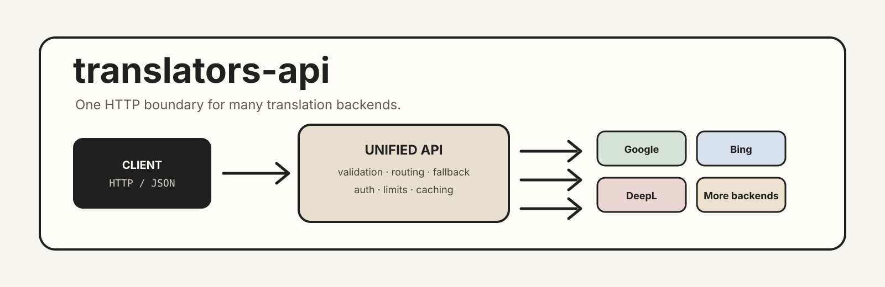

<div align="center">



# translators-api

**A self-hosted HTTP gateway that exposes the Python [Translators](https://github.com/UlionTse/translators) library as a small JSON API.**

<p>
  <a href="https://github.com/UlionTse/translators"></a>
  
  
  
</p>

<p>
  <a href="#readme-overview">Overview</a> ·
  <a href="#readme-quick-start">Quick Start</a> ·
  <a href="#readme-api">API</a> ·
  <a href="#readme-configuration">Configuration</a> ·
  <a href="#readme-deployment">Deployment</a> ·
  <a href="#readme-development">Development</a>
</p>

</div>

---

<a name="readme-overview"></a>
##  Overview

`translators-api` puts a conventional HTTP boundary in front of the Python **Translators** library.

The server accepts JSON requests, validates them, selects an upstream translator, executes the provider call, and returns a predictable response. Clients only need HTTP; they do not need to embed the Python package or implement provider-specific integrations.

```text
┌───────────────────────────────┐
│           Clients             │
│ browser · desktop · web · CI  │
└──────────────┬────────────────┘
               │ HTTP + JSON
               ▼
┌───────────────────────────────┐
│        translators-api        │
│ validation · auth · limits    │
│ fallback · errors · IDs       │
└──────────────┬────────────────┘
               │
               ▼
┌───────────────────────────────┐
│          Translators          │
│ provider-specific adapters    │
└───────────────────────────────┘
```

### Why a gateway

Without a gateway, every client that needs translation has to understand the Python runtime or a provider-specific integration. The gateway centralizes that complexity and gives every client the same contract.

### Scope

The project is intentionally thin. It does **not** reimplement translation providers and it does not currently provide a database, user-account system, distributed queue, shared cache, or cluster-wide rate limiter.

The upstream [Translators project](https://github.com/UlionTse/translators) remains responsible for provider integrations, provider-specific behavior, language maps, and upstream network interaction.

---

<a name="readme-quick-start"></a>
##  Quick Start

### Requirements

- Python `3.10+`
- Network access to the selected upstream translator
- Optional Docker or Windows x64 for the alternative deployment paths

### Install from source

```bash
git clone https://github.com/CYoJkoY/translators-api.git
cd translators-api

python -m venv .venv
```

Activate the environment:

```bash
# Linux / macOS
source .venv/bin/activate

# Windows PowerShell
.\.venv\Scripts\Activate.ps1
```

Install the service:

```bash
python -m pip install --upgrade pip
python -m pip install .
```

Install test dependencies as well:

```bash
python -m pip install -e ".[test]"
```

### Start

With Uvicorn:

```bash
uvicorn translators_api.main:app --host 127.0.0.1 --port 8000
```

Or with the packaged CLI:

```bash
translators-api --host 127.0.0.1 --port 8000
```

The CLI also supports `--log-level` and `--version`.

### Verify

```bash
curl http://127.0.0.1:8000/health
```

```json
{
  "status": "ok",
  "version": "0.1.0"
}
```

Interactive documentation is available at:

| URL | Purpose |
| :--- | :--- |
| `/docs` | Swagger UI |
| `/redoc` | ReDoc |
| `/openapi.json` | OpenAPI document |
| `/health` | Liveness |
| `/ready` | Readiness |

### First translation

```bash
curl -X POST http://127.0.0.1:8000/v1/translate \
  -H "Content-Type: application/json" \
  -d '{
    "text": "你好，世界",
    "source": "zh",
    "target": "en",
    "translator": "bing"
  }'
```

Response shape:

```json
{
  "text": "你好，世界",
  "translation": "Hello, world",
  "source": "zh",
  "target": "en",
  "translator": "bing",
  "fallback": false,
  "request_id": "req_..."
}
```

---

<a name="readme-api"></a>
##  API

All application endpoints are under `/v1`. `/health` and `/ready` are operational endpoints and remain outside that namespace.

| Method | Endpoint | Purpose |
| :--- | :--- | :--- |
| `GET` | `/health` | Confirm the process is alive |
| `GET` | `/ready` | Confirm the upstream translator pool is usable |
| `GET` | `/v1/translators` | List available translator backends |
| `GET` | `/v1/languages` | List languages for one translator |
| `POST` | `/v1/translate` | Translate one text value |
| `POST` | `/v1/translate/batch` | Translate multiple text values |
| `POST` | `/v1/translate/html` | Translate an HTML fragment |

### `POST /v1/translate`

```json
{
  "text": "Hello, world!",
  "source": "en",
  "target": "zh-CN",
  "translator": "bing"
}
```

| Field | Type | Default | Description |
| :--- | :--- | :--- | :--- |
| `text` | string | required | Non-blank text. Maximum size is `MAX_TEXT_LENGTH`. |
| `source` | string | `auto` | Source language identifier. |
| `target` | string | `en` | Target language identifier. |
| `translator` | string or `null` | configured default | Specific translator, or `auto` / `detect` / `all` for fallback mode. |

A successful response includes the actual translator used and a `fallback` flag.

### `POST /v1/translate/batch`

```json
{
  "texts": ["Hello", "How are you?", "Good morning"],
  "source": "en",
  "target": "zh-CN",
  "translator": "auto"
}
```

The service translates items concurrently up to `MAX_BATCH_CONCURRENCY`. The returned `items` keep the original order through an explicit `index` field.

```json
{
  "items": [
    { "index": 0, "text": "Hello", "translation": "你好" },
    { "index": 1, "text": "How are you?", "translation": "你好吗？" },
    { "index": 2, "text": "Good morning", "translation": "早上好" }
  ],
  "source": "en",
  "target": "zh-CN",
  "translator": "bing",
  "fallback": false,
  "request_id": "req_..."
}
```

When different items use different fallback backends, `translator` can be `mixed`.

### `POST /v1/translate/html`

```json
{
  "html": "<p>Hello, <strong>world!</strong></p>",
  "source": "en",
  "target": "zh-CN",
  "translator": "bing"
}
```

HTML translation follows the same translator-selection and fallback rules as text translation. Its size is limited by `MAX_TEXT_LENGTH`.

### `GET /v1/translators`

```bash
curl http://127.0.0.1:8000/v1/translators
```

```json
{
  "translators": ["alibaba", "baidu", "bing"],
  "default": "bing",
  "fallback": ["bing", "google", "deepl", "baidu"]
}
```

The exact translator list comes from the installed upstream package and can change independently of this API project.

### `GET /v1/languages`

```bash
curl "http://127.0.0.1:8000/v1/languages?translator=bing"
```

The returned language identifiers are provided by the selected upstream backend.

### Automatic fallback

The fallback mechanism is intentionally explicit:

```text
translator = concrete name
       │
       └──► try that backend only

translator = auto / detect / all
       │
       ▼
FALLBACK_TRANSLATORS
       │
       ├── success ──► response
       ├── failure ──► next backend
       └── all fail ─► 502
```

The response reports `fallback: true` when an automatic request succeeds only after moving beyond the first candidate.

### Authentication

Set `TRANSLATORS_API_KEY` to require a bearer token for `/v1/*`:

```bash
curl http://127.0.0.1:8000/v1/translators \
  -H "Authorization: Bearer YOUR_API_KEY"
```

When the environment variable is empty or unset, authentication is disabled. This default is convenient for local development; it should not be used as the security boundary of a public deployment.

`/health` and `/ready` are intentionally not protected so container and process health checks can reach them.

### Request IDs

Every application response includes the `X-Request-ID` header. Translation responses and structured errors also expose the identifier as `request_id`.

### Errors

The JSON shape is consistent across application errors:

```json
{
  "error": {
    "code": "translation_failed",
    "message": "all translators failed",
    "request_id": "req_..."
  }
}
```

| Status | Code | Meaning |
| :--- | :--- | :--- |
| `400` | `unknown_translator` / `request_error` | Invalid translator or HTTP-level request problem |
| `401` | `unauthorized` | Missing or invalid bearer token |
| `413` | `payload_too_large` | Text, HTML, or batch limit exceeded |
| `422` | `validation_error` | Request body failed schema validation |
| `429` | `rate_limited` | Local rate limit exceeded |
| `502` | `translation_failed` / `request_error` | Upstream translation failure |

---

<a name="readme-configuration"></a>
##  Configuration

Configuration is provided through environment variables. See [`.env.example`](.env.example) for the same defaults in file form.

| Variable | Default | Description |
| :--- | :--- | :--- |
| `TRANSLATORS_API_KEY` | empty | Bearer token for `/v1/*` authentication. |
| `HOST` | `0.0.0.0` | Default bind address used by the CLI. |
| `PORT` | `8000` | Default HTTP port used by the CLI. |
| `LOG_LEVEL` | `info` | Uvicorn log level. |
| `MAX_TEXT_LENGTH` | `20000` | Maximum text or HTML length in characters. |
| `MAX_BATCH_ITEMS` | `50` | Maximum number of items in one batch. |
| `MAX_BATCH_TOTAL_LENGTH` | `100000` | Maximum combined batch length in characters. |
| `MAX_BATCH_CONCURRENCY` | `5` | Maximum concurrent upstream calls for a batch. |
| `UPSTREAM_TIMEOUT` | `30` | Upstream timeout in seconds. |
| `RATE_LIMIT_REQUESTS` | `120` | Requests allowed per rate-limit window. |
| `RATE_LIMIT_WINDOW_SECONDS` | `60` | Rate-limit window length in seconds. |
| `DEFAULT_TRANSLATOR` | `bing` | Backend used when `translator` is omitted. |
| `FALLBACK_TRANSLATORS` | `bing,google,deepl,baidu` | Ordered candidates used by automatic selection. |

### Rate-limit scope

The built-in limiter is stored in application memory and is therefore **process-local**. Multiple workers or instances do not share the same counter.

For multi-worker or horizontally scaled deployments, use a shared limit at the reverse proxy or edge rather than relying on this in-process limiter as a global quota.

### Environment example

```text
TRANSLATORS_API_KEY=
HOST=0.0.0.0
PORT=8000
LOG_LEVEL=info

MAX_TEXT_LENGTH=20000
MAX_BATCH_ITEMS=50
MAX_BATCH_TOTAL_LENGTH=100000
MAX_BATCH_CONCURRENCY=5
UPSTREAM_TIMEOUT=30

RATE_LIMIT_REQUESTS=120
RATE_LIMIT_WINDOW_SECONDS=60

DEFAULT_TRANSLATOR=bing
FALLBACK_TRANSLATORS=bing,google,deepl,baidu
```

---

<a name="readme-architecture"></a>
##  Architecture

The implementation keeps each concern in a small, explicit module:

```text
src/translators_api/
├── __init__.py   package version
├── cli.py        CLI entry point
├── config.py     environment-backed settings
├── models.py     Pydantic request / response models
├── service.py    upstream Translators adapter + fallback
└── main.py       FastAPI routes, auth, limits, errors
```

### Responsibility boundary

```text
┌──────────────────────────────────────────────┐
│                 API layer                    │
│ HTTP · validation · auth · limits · errors   │
└──────────────────────┬───────────────────────┘
                       │
                       ▼
┌──────────────────────────────────────────────┐
│              TranslationService              │
│ selection · fallback · async thread bridge   │
└──────────────────────┬───────────────────────┘
                       │
                       ▼
┌──────────────────────────────────────────────┐
│               Translators                    │
│ provider-specific translation implementations│
└──────────────────────────────────────────────┘
```

The gateway does not duplicate the provider implementations from `Translators`. Synchronous upstream calls are executed through `asyncio.to_thread(...)` so normal provider work does not block the FastAPI event loop.

Batch requests add an `asyncio.Semaphore` to bound concurrent provider calls.

### Readiness model

`/health` checks process liveness only. `/ready` attempts to discover the available translator pool and returns `503` when the upstream translator engine is unavailable or no translator is exposed.

---

<a name="readme-deployment"></a>
##  Deployment

The repository supports three practical delivery modes.

### Docker

Build:

```bash
docker build -t translators-api .
```

Run:

```bash
docker run --rm \
  -p 8000:8000 \
  -e TRANSLATORS_API_KEY=change-me \
  translators-api
```

The image runs the same FastAPI application as the source installation and exposes port `8000`.

Release automation publishes versioned images to GitHub Container Registry. Stable tags additionally update `latest`, while development tags do not overwrite it.

```bash
docker pull ghcr.io/cyojkoy/translators-api:latest
```

### Python distribution

Release builds produce Python distributions. Local installation from a checkout is:

```bash
python -m pip install .
translators-api --host 0.0.0.0 --port 8000
```

Use the repository's [Releases](https://github.com/CYoJkoY/translators-api/releases) page for published build artifacts.

### Windows x64 portable bundle

Release automation builds an `onedir` PyInstaller bundle for Windows x64.

Example filename:

```text
translators-api-v0.1.0-windows-x64.zip
```

After extraction:

```powershell
.\translators-api.exe --host 127.0.0.1 --port 8000
```

The bundle includes the required runtime files and does not require a separate Python installation on the target machine.

### Production topology

```text
Internet
   │
   ▼
TLS / reverse proxy
   │
   ├── access policy
   ├── shared rate limiting
   └── request logging
          │
          ▼
   translators-api
          │
          ▼
      Translators
```

Keep `TRANSLATORS_API_KEY` outside source control, terminate TLS at the edge, and do not treat the process-local limiter as a cluster-wide security control.

---

<a name="readme-development"></a>
##  Development

### Install development dependencies

```bash
python -m pip install -e ".[test]"
```

### Test

```bash
python -m pytest
```

### Compile check

```bash
python -m compileall -q src
```

### Windows bundle build

```powershell
python -m pip install -e ".[build]"

python -m PyInstaller `
  --noconfirm `
  --clean `
  --onedir `
  --name translators-api `
  --distpath build/windows `
  --workpath build/pyinstaller `
  --specpath build/pyinstaller `
  --paths src `
  src/translators_api/cli.py
```

### CI

Pull requests and pushes to `main` run the test matrix on Python `3.10`, `3.11`, `3.12`, and `3.13`.

The CI pipeline installs the project, compiles the source, runs the test suite, and then builds the Docker image.

Tag-triggered release automation additionally:

```text
validate tag + package version
          ↓
build Python distributions
          ↓
build + smoke-test Windows bundle
          ↓
build + publish Docker image
          ↓
create GitHub Release
```

Release tags follow the form:

```text
vX.Y.Z        → stable release
vX.Y.Z.devN   → prerelease
```

### Development principle

Keep the HTTP contract provider-neutral. Provider-specific behavior should remain upstream unless a new capability represents a stable, reusable part of the gateway contract.

---

<a name="readme-compatibility"></a>
##  Compatibility

| Component | Current contract |
| :--- | :--- |
| Python | `>=3.10` |
| FastAPI | `>=0.115,<1` |
| Uvicorn | `>=0.34,<1` |
| Pydantic | `>=2.10,<3` |
| Translators | `>=6.0,<7` |
| Windows bundle | Windows x64 |
| Client | Any runtime capable of HTTP requests |

The upstream `Translators` project has its own provider availability, language support, and runtime behavior. Those details can change independently of this gateway.

Use the [upstream repository](https://github.com/UlionTse/translators) as the authoritative source for the provider matrix.

---

<a name="readme-limitations"></a>
##  Limitations

A gateway cannot remove limitations imposed by the services behind it.

| Area | Limitation |
| :--- | :--- |
| Provider availability | A provider may throttle, block, change, or remove an access path. |
| Translation quality | Output quality depends on the selected upstream backend. |
| Network environment | Geography, connectivity, anti-bot controls, headers, cookies, and provider behavior can affect requests. |
| Upstream quotas | Provider-side restrictions still apply. |
| Fallback | Fallback improves resilience but cannot help if every candidate fails. |
| Scaling | Built-in rate limiting is process-local. |
| Privacy | Submitted translation content is sent to the selected upstream provider. |

This project should therefore be treated as an **integration and orchestration layer**, not as an independent translation provider.

---

<a name="readme-roadmap"></a>
##  Roadmap

The current project deliberately focuses on a small, useful gateway.

Possible future directions include:

```text
shared / distributed rate limiting
shared caching
richer observability
provider capability metadata
broader deployment integrations
```

These items are ideas rather than part of the current API contract until implemented.

---

<a name="readme-upstream"></a>
##  Upstream

`translators-api` builds on **[UlionTse/translators](https://github.com/UlionTse/translators)**.

The upstream project provides the translation-provider implementations and Python-facing functionality such as text translation, HTML translation, translator discovery, and language discovery. This repository turns a focused subset of that capability into an HTTP service.

See the upstream project for:

- supported provider services;
- provider-specific parameters and behavior;
- upstream language support;
- upstream installation and compatibility details.

---

<a name="readme-support"></a>
##  Support

Support helps sustain maintenance, compatibility work, testing, documentation, and future development.

<a href="https://cyojkoy.github.io/Payment/">
  
</a>

Canonical support page: **https://cyojkoy.github.io/Payment/**

---

<a name="readme-contributing"></a>
##  Contributing

Contributions should improve the API contract, reliability, testing, documentation, deployment experience, or maintainability.

Before adding provider-specific HTTP behavior, check whether the capability already belongs in the upstream `Translators` project. Keep this gateway small, predictable, and provider-neutral where practical.

For defects and feature requests, use the repository's [GitHub Issues](https://github.com/CYoJkoY/translators-api/issues).

---

<a name="readme-license"></a>
##  License

`translators-api` is licensed under the **GNU General Public License v3.0 only**.

See [`LICENSE`](LICENSE) for the complete license text.

The project wraps the separate `Translators` dependency. Review the upstream project's license and notices when redistributing a combined deployment.

---

<div align="center">

**translators-api** · one HTTP boundary for many translation backends

[Repository](https://github.com/CYoJkoY/translators-api) · [Issues](https://github.com/CYoJkoY/translators-api/issues) · [Releases](https://github.com/CYoJkoY/translators-api/releases)

</div>
